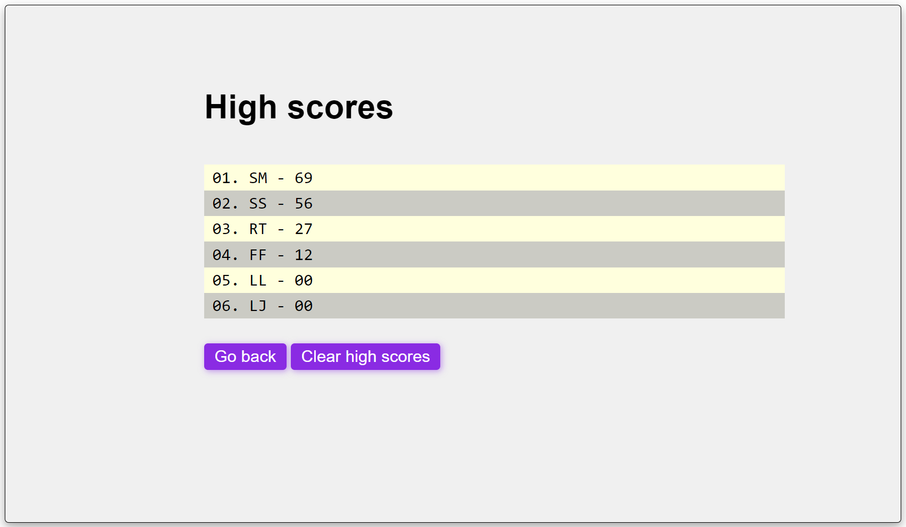

# JavaScript Coding Quiz
A quiz about coding made using JavaScript, CSS and HTML only

## Description
The JavaScript Coding Quiz is a quiz where 5 questions are asked one after another, and result/feedback of the question is instantly displayed after. 

### Quiz Instruction Page
The first page of the program consists of the instructions/rules about the quiz. The rule of the quiz is:
* Time limit is 75 secconds
* The time left at the end of the quiz is the score
* Incorrect answers penalize the score/time by 15 seconds!
  
Screenshot showing the quiz instruction page

### Quiz Page
Pressing the '*Start Quiz*' button starts the quiz. As soon as the quiz starts, the timer is started with 75 seconds limit and will reduce by a second per second.
Only one question is displayed at a time. An user has to click the correct button as his/her answer to the question. As soon as one of the four buttons (possible answers) is pressed, next question is displayed, and underneath it, the feedback/result of the user's response to the previous question is displayed either as '*Right!*' or '*Wrong!*'.

 Screenshot showing the start of the Quiz

Screenshot showing the result/feedback

### Quiz Tally Page
If the answer is correct, the timer will continue normally, however, if the answer is wrong, the timer will instantaneously be deducted by 15 seconds. So the quiz will end either when all the questions are answered, or when the time limit is reached i.e. the timer is finished (after 75 seconds have elapsed), also thereby effectively setting the score to 0 as well, when it is the case; as at the end of the quiz, the time left on the clock is the user's score for that game. After the quiz is finished, the user is taken to another page where, the end of the quiz is displayed along with his/her score for the game. The user can enter his/her initials and submit his/her current score. The user input for initials are validated against certain criteria. The criteria being the user must type in 2 letters only as his/her initials.

Screenshot showing the end of the quiz

Screenshot showing the validation of initials

### Leaderboard Page
The user's recent score is only added to the record, if it is his/her first record or if it is higher than his/her previous high score. When the correct user input is submitted, the final page - leaderboard is displayed where all the users' high scores are shown in a descending order. In this page the user can clear the high scores. He/she can also go back to corresponding previous pages. Clicking the '*View high scores*' link brings the user to the leaderboard page. And, pressing the '*Go back*' button on the leaderboard page takes the user back to the page he/she was on before coming to the leaderboard page. If the user had pressed the 'view high scores' button while in the middle of the quiz, the timer would pause until the user returned back to the quiz from the leaderboard page, and when he/she is back, the timer will resume, and the same question will be displayed where he/she initially was.

Screenshot showing the leaderboard

## Quirks of the program
All the events triggered by clicking the buttons or pressing the Enter key are, for simplicity sake, called with inline HTML 'Onclick' and "onkeyup' functions. The addEventListener would have been a better choice, I guess. The quiz questions are dynamically created in the DOM, not hardcodded in the HTML. They could have all been simply coded in HTML and just shown and hidden as needed. I simply don't know which approach would be better. Similarly, the '*Right!*' and '*Wrong!*' responses are also dynamically created in this program. And, so is the order list of high scores in the leaderboard.

All the users' data i.e. initials and scores are directly injected to the local storage, but unfortunately, in the process of learning, at the latter stage of this project, I realized that the local storage is shared by other programs/projects. So simply saving initials and score as the key and value pair is not a good idea. Due to the time limit, I left it as it is, and at this stage, as long as the local storage is not being shared or used by other programs, this program's data retrieving and saving should not be a problem. I highly recommend that the user data is stored in an array of user objects and then JSON stringify applied and saved in the local storage. 

## Acknowledgement

- The string shake animation is copied from the following source:
    https://teamtreehouse.com/community/shake-effect-with-javascript-only
- The normaize.css is downloaded from:
   http://meyerweb.com/eric/tools/css/reset/
   v2.0 | 20110126
   License: none (public domain)

## Link to deployed application
[Link to deployed JavaScript coding quiz challenge](https://simplesuyash.github.io/js-quiz/)

